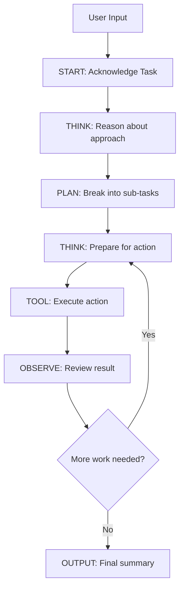

# 🤖 AI Agent CLI Tool — Scaler Website Clone Generator

A conversational CLI agent — similar to Cursor or Windsurf — where you can chat with an AI agent directly in the terminal. The agent takes your natural language instructions and generates a fully working clone of the **Scaler Academy** website using HTML, CSS, and JavaScript.

## 📖 Table of Contents

- [Features](#-features)
- [Architecture](#-architecture)
- [Prerequisites](#-prerequisites)
- [Installation](#-installation)
- [Usage](#-usage)
- [Agent Loop & Reasoning](#-agent-loop--reasoning)
- [Tools Available](#-tools-available)
- [Project Structure](#-project-structure)
- [Demo](#-demo)

---

## ✨ Features

- **Interactive CLI Chat** — Talk to the AI agent directly in your terminal
- **Structured Reasoning Loop** — The agent follows a multi-step reasoning process (START → THINK → PLAN → TOOL → OBSERVE → OUTPUT) instead of doing everything in one shot
- **Tool-based Execution** — The agent uses tools to write files, read files, list directories, execute commands, and open the browser
- **Beautiful Terminal UI** — Color-coded output with emojis, spinners, and formatted step indicators
- **Automatic Browser Launch** — The generated website opens automatically in your default browser
- **Scaler Academy Clone** — Generates a pixel-approximate clone with Header, Hero Section, and Footer
- **Ultra-Fast Inference** — Powered by Groq's lightning-fast LPU inference engine with Llama 3.3 70B

---

## 🏗️ Architecture

The agent uses a **ReAct (Reason + Act)** pattern:

```
User Input → START → THINK → PLAN → TOOL → OBSERVE → THINK → TOOL → OBSERVE → ... → OUTPUT
```



Each iteration, the agent:
1. **Thinks** about the current state and what needs to be done
2. **Calls a tool** (write file, read file, etc.)
3. **Observes** the result
4. **Decides** whether to continue or finish

---

## 📋 Prerequisites

- **Node.js** v18+ 
- **npm** (comes with Node.js)
- **Groq API Key** — Get one for free from [console.groq.com](https://console.groq.com/keys)

---

## 🚀 Installation

1. **Clone the repository**
   ```bash
   git clone https://github.com/YOUR_USERNAME/ai-agent-cli.git
   cd ai-agent-cli
   ```

2. **Install dependencies**
   ```bash
   npm install
   ```

3. **Set up your API key**
   ```bash
   cp .env.example .env
   # Edit .env and paste your Groq API key
   ```

4. **Run the agent**
   ```bash
   npm start
   ```

---

## 💻 Usage

After starting the agent, you'll see an interactive prompt:

```
╔══════════════════════════════════════════════════════════════╗
║        🤖  AI Agent CLI — Website Clone Generator  🤖        ║
║              (Powered by Groq + Llama 3.3 70B)              ║
╚══════════════════════════════════════════════════════════════╝

✓ Groq API key detected

You ▸ Clone the Scaler Academy website with header, hero section, and footer
```

### Example Commands

| Command | Description |
|---------|-------------|
| `Clone the Scaler Academy website` | Generates a full Scaler clone |
| `Create a landing page for scaler.com` | Generates the homepage |
| `exit` or `quit` | Exits the agent |

The agent will:
1. **Acknowledge** your request
2. **Plan** the files to create (CSS → HTML → JS)
3. **Create** each file step by step with real code
4. **Verify** the files were written correctly
5. **Open** the result in your browser

---

## 🔄 Agent Loop & Reasoning

The agent does NOT complete everything in a single step. It follows a **multi-step reasoning loop**:

| Step | Purpose |
|------|---------|
| `START` | 🚀 Acknowledges the user's request |
| `THINK` | 🧠 Reasons about the next sub-task |
| `PLAN` | 📋 Breaks the task into file-creation steps |
| `TOOL` | 🔧 Calls a tool (writeFile, readFile, etc.) |
| `OBSERVE` | 👁️ Reviews the tool's output |
| `OUTPUT` | ✅ Delivers the final summary |

The agent typically takes **15-25 iterations** to complete a website clone, ensuring each file is created, verified, and the result is properly tested.

---

## 🛠️ Tools Available

| Tool | Arguments | Description |
|------|-----------|-------------|
| `writeFile` | `filename`, `content` | Creates/overwrites a file in `output/` |
| `readFile` | `filename` | Reads a file from `output/` |
| `listFiles` | *(none)* | Lists all files in `output/` |
| `executeCommand` | `cmd` | Runs a shell command |
| `openInBrowser` | `filename` | Opens an HTML file in the browser |

---

## 📁 Project Structure

```
ai-agent-cli/
├── index.js          # Main CLI agent — reasoning loop & chat interface
├── tools.js          # Tool definitions (writeFile, readFile, etc.)
├── package.json      # Dependencies and scripts
├── .env              # Your Groq API key (not committed)
├── .env.example      # Example environment file
├── .gitignore        # Git ignore rules
├── README.md         # This file
└── output/           # Generated website files (created at runtime)
    ├── index.html
    ├── style.css
    └── script.js
```

---

## 🎥 Demo

> **YouTube Demo**: [Watch the agent in action](YOUR_YOUTUBE_LINK_HERE)

The demo shows:
1. Starting the CLI agent
2. Giving the instruction to clone Scaler Academy
3. The agent reasoning and creating files step by step
4. The final website opening in the browser

---

## 📝 License

ISC
